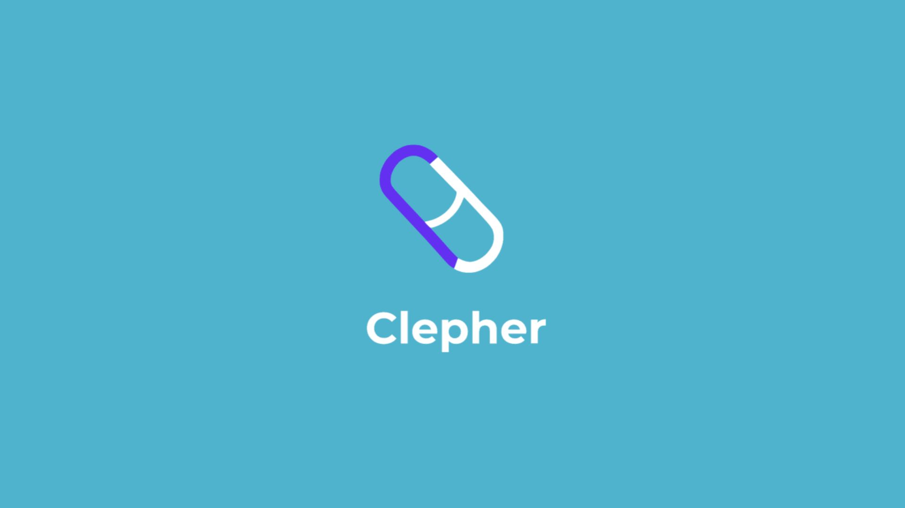
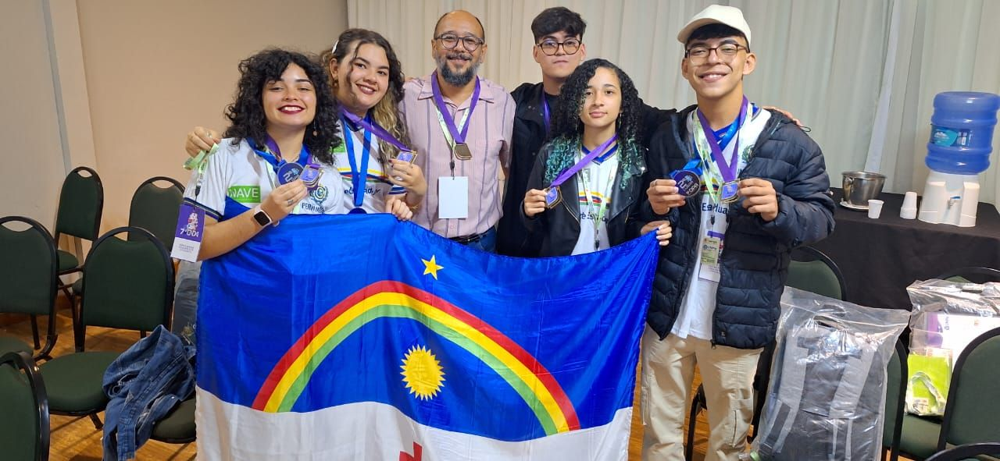

# Clepher: Inovando o Cuidado com a Terceira Idade

O **Clepher** é um aplicativo móvel idealizado para facilitar o monitoramento da saúde de pessoas idosas, criando uma ponte de comunicação direta e eficiente entre os familiares e seus entes queridos. O projeto nasceu da necessidade de suprir a falta de ferramentas tecnológicas adequadas para o acompanhamento contínuo da população idosa no Brasil, um desafio identificado durante o período letivo na Escola Técnica Estadual Cícero Dias.

---

## O Problema

A falta de ferramentas tecnológicas para o monitoramento da saúde de idosos impõe um desafio significativo para muitas famílias. O acompanhamento contínuo por parte de familiares muitas vezes demanda tempo e recursos financeiros consideráveis, e a ausência de soluções acessíveis e integradas dificulta a gestão da saúde de forma proativa.

---

## A Solução

O **Clepher** foi idealizado para ser uma solução robusta e funcional, destacando-se no mercado por sua acessibilidade e funcionalidades-chave. O aplicativo foi idealizado e desenvolvido pelo time "Vingadores do Mangue" com a missão de oferecer uma plataforma que se conectasse diretamente com o dia a dia da família.

---

### Funcionalidades

O planejamento é para que **Clepher** ofereça uma interface intuitiva e funcionalidades essenciais para o monitoramento e a comunicação:

* **Sinais Vitais:** Permite o acompanhamento de dados de saúde, com integração à API do Google Fit, que possibilita a coleta de informações diretamente de smartwatches.
* **Gestão de Remédios e Alarmes:** Facilita a criação de lembretes para a administração de medicamentos e compromissos.
* **Agenda de Compromissos:** Uma ferramenta para organizar e visualizar consultas e eventos importantes.
* **Botão de Emergência:** A funcionalidade mais importante, que envia alertas imediatos para familiares e hospitais próximos, contendo informações vitais do idoso.

---

### Tecnologias e Metodologias

Para o desenvolvimento do Clepher, utilizamos uma abordagem ágil e tecnologias modernas:

* **Tecnologias:** A ideia é para que o aplicativo seja desenvolvido com **Dart** e **Flutter**, garantindo que a solução fosse multiplataforma (Android e iOS) e tivesse uma interface amigável.
* **Metodologias:** A idealização do produto seguiu metodologias como **Lean Inception** e **Canvas MVP** para definir as funcionalidades mínimas viáveis e garantir o alinhamento com as necessidades do público-alvo. A pesquisa quantitativa com 30 pessoas e a criação de personas (Maria e Rosa) foram cruciais para validar a proposta de valor.

---

## Reconhecimentos

O projeto Clepher demonstrou nossa capacidade de identificar um problema social relevante e de aplicar metodologias eficientes para a criação de uma solução tecnológica completa. O reconhecimento do nosso trabalho veio por meio de importantes premiações:

* **2º lugar** na 1ª Olimpíada Pernambucana de Aplicativos
* **3º lugar** na 7ª Olimpíada Nacional de Aplicativos em 2024

---

## Vingadores do Mangue

* Allana Sílvia Gadêlha - [Linkedin](https://www.linkedin.com/in/allana-gad%C3%AAlha-515507249/)
* Camila Maria Teixeira - [Linkedin](https://www.linkedin.com/in/camilamta275/)
* Lucas Filipe de Lima - [Linkedin]()
* Luís Silvestre - [Linkedin](https://www.linkedin.com/in/luismsmelo/)
* Rebeca Borges Figueirôa - [Linkedin](https://www.linkedin.com/in/rebeca-borges-814151285/)
* Rogerio Martins Soares - [Linkedin](https://www.linkedin.com/in/rogerio-msoares/)

